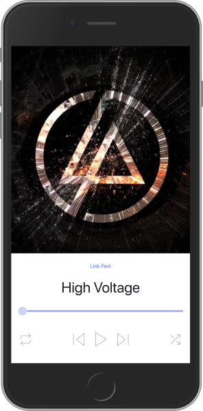

<h4 align="center">
	📱 E-Learning App
</h4>

<p align="center">
 <a href="#-about">About</a> •
 <a href="#features">Features</a> •
 <a href="#-layout">Layout</a> •
 <a href="#-how-it-works">How it works</a> •
 <a href="#-tech-stack">Tech Stack</a> •
 <a href="#author">Authors</a> •
 <a href="#-license">License</a> •
 <a href="#versions-of-readme">Version Portuguese(BR)</a>
</p>

## 💻 About

📱 This applications is a simple music-player ui, get more information on figma url.

## ⚙️ Features

- [x] Controlls
- [x] Progress bar
- [x] Header
- [x] Music screen

---

## 🎨 Layout

The application layout is available on Figma:

<a href="https://www.figma.com/file/8xQ3f7Wq4kFbsgnQMQfqs5/00---Brainstorming-UI-Style-Guide-V1-(Copy)?node-id=0%3A5792">
  
</a>

### Mobile

<p align="center">
   
</p>

---

## 🚀 How it works

💡
Install the nodejs version less than or equal to 12.9, higher versions may have an error when running on the android emulator.

### Pre-requisites

Before you begin, you will need to have the following tools installed on your machine:
[Git](https://git-scm.com), [Node.js](https://nodejs.org/en/), [React-Native](https://https://reactnative.dev/), [Expo](https://expo.io/)
In addition, it is good to have an editor to work with the code like [VSCode](https://code.visualstudio.com/)

#### 🧭 Rodando a aplicação

```bash

# Clone this repository
$ git clone https://github.com/geanfeltrin/music-player-ui-rn.git

# Access the project folder cmd/terminal
$ cd music-player-ui-rn

# Install the dependencies
$ yarn or npm install

# Run the application in development mode
$ yarn start or npm run start

# The application will open in emulator of your choice

```

---

## 🛠 Tech Stack

The following tools were used in the construction of the project:

#### **Mobile** ([React-native])(https://https://reactnative.dev/)

- **[Expo](https://expo.io/)**
- **[Expo audio](https://docs.expo.io/versions/latest/sdk/audio/)**

## 🦸 Authors

<a href="https://github.com/geanfeltrin">
 
 <br />
  <sub>
    <b>Gean Feltrin - Web Developer</b>
  </sub>
</a>
 <br />

[](https://twitter.com/Geanfeltrin1) [](https://www.linkedin.com/in/geanfeltrin/)
[](mailto:geanfeltrin75@gmail.com)

---

## 📝 License

This project is under the license [MIT](./LICENSE).

Made with love by Gean Feltrin 👋🏽 [Entre em contato!](https://www.linkedin.com/in/geanfeltrin/)

---

## Versions of README

[English 🇺🇸](./README.md)
